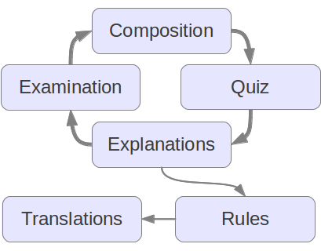

=======
Quizzer
=======
---------------------------------------
A Tool for Academic Writing Instruction
---------------------------------------

:author: Frank Bennett

Quizzer is a new tool developed for use in the Academic Writing
program in the Faculty of Law at Nagoya University. It addresses a
long-standing challenge: the need to bring students with basic writing
ability to the level of mastery needed for professional purposes
quickly, *before* beginning the final write-up of thesis research.

Stated another way, there is a pressing need to move away from the
*post hoc* "English Check" of thesis text, to a system of instruction
that enables students to present their work directly for assessment.
Doing so requires innovative thinking: while the "English Check"
approach to thesis submission is an obvious response, and therefore
common in overseas student programs worldwide, it is equally
ineffective everywhere. In our own case, it is simply not sustainable:
with the recent expansion in overseas student enrollment, "English
Check" is rapidly overwhelming staff resources.

Traditionally, composition is taught by frequent assignment of essays,
with intensive feedback on each assignment by the instructor or a
teaching assistant. This approach depends on two catalyzing factors
that are not found in our environment: (1) a large pool of
postgraduates with strong writing skills, willing to serve as tutors
for modest compensation; and (2) a sufficient number of students with
a good grasp of composition to stimulate a competitive culture of
excellence. In the absence of these factors, this approach is not an
option.

Quizzer treats writing instruction as essentially a matter of *pattern
practice* and motivation. Students faced with the daunting task of
thesis writing are highly motivated to improve their skills. The
ability to master patterns through repeated exposure is a natural
trait that we all share. Grammatical patterns can be mastered
through rapid iteration by highly motivated students.

On these premises, the Quizzer method adopts the following workflow:

1. Each student submits a writing sample once per week.
2. From each student essay, instructors selects one poorly composed sentence
   to use as the basis of a quiz question. Questions consist of the
   target sentence, two flawed alternatives, and a correct sentence.
   *The essays themselves are not assessed.*
3. Personal links to the resulting quiz are sent to class members.
4. Students submit their responses, which are recorded on the
   Quizzer server. On submission, each student receives immediate
   feedback on their incorrect responses.
5. Academic Writing instructors post short explanations of why the
   wrong answers were wrong to the Quizzer site. Common errors are
   tagged with a standardized "rule" that provides a full explanation
   of the grammatical issue.
6. When revisiting the quiz link, each student sees only the feedback
   posted against their specific wrong answers. This avoids the
   distraction of generalized instruction that the student does not
   require.
7. When a student successfully avoids breaking a given rule five times
   in a row, the rule is opened to them for editing *in their native
   language*. The native language explanation is shown, in preference
   to the English explanation, to all students from the same language
   domain.
8. In the 7th and the 14th week of Academic Writing class,
   students are given a paper-based multiple-choice examination,
   consisting entirely of questions from the quizzes. This motivates
   students to do their best on the quizzes themselves (which are not
   assessed), and to study their mistakes.

Quizzer is designed to support classroom instruction, but the quizzes,
rules and multilingual content that it produces can be leveraged in
several ways:

* Staff and alumni can join a class as "external" members, and use the
  class-generated quiz "challenges" as a tool of self-study.
* The multilingual rule glosses can be compiled as a textbook
  to be shared with partner institutions in the field.
* Quizzer is potentially useful to the Japan Law Center initiative, as
  it allows instructors in the field to provide feedback on the work
  of students who have proceeded to study in our Faculty.

The Quizzer cycle is illustrated below.

